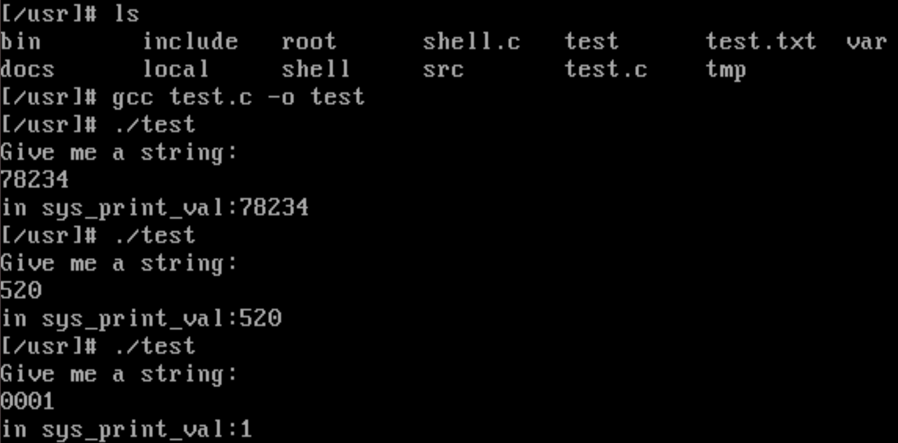
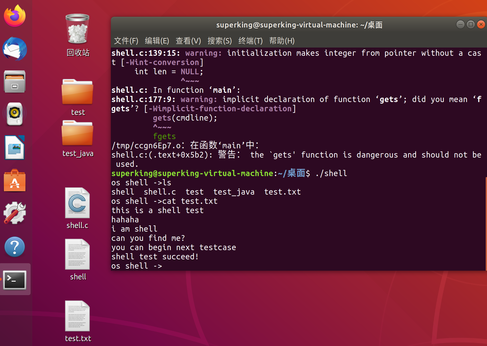
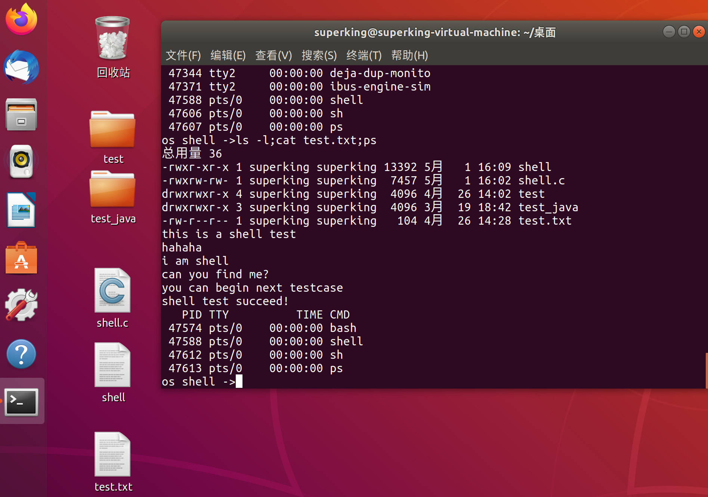
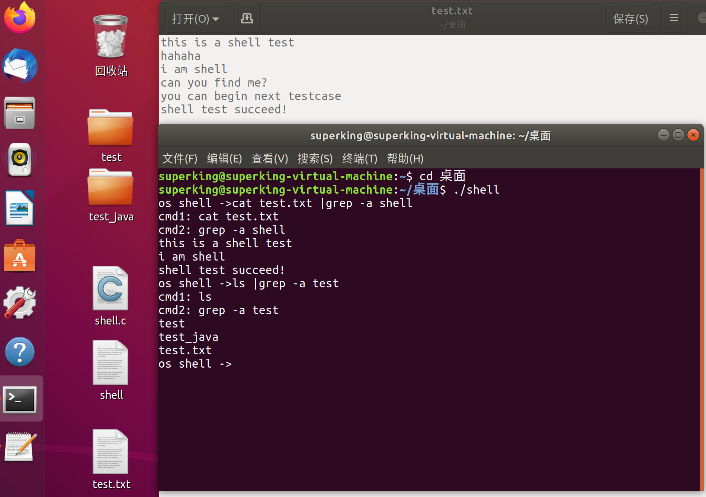
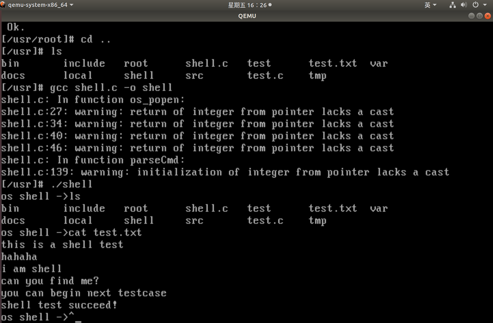
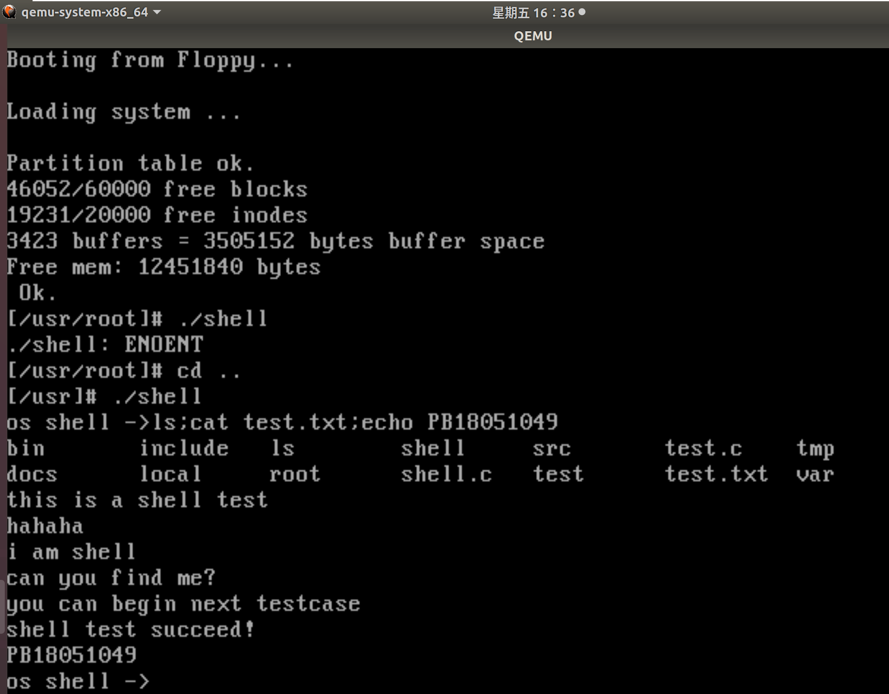
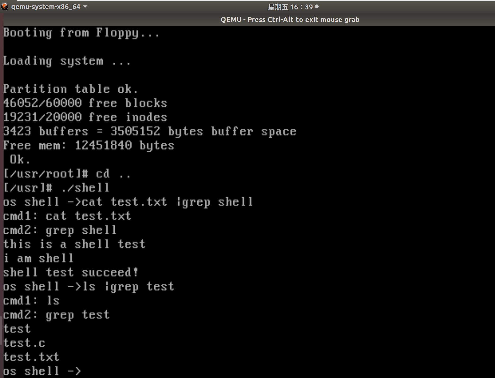

# <center>《操作系统原理与设计》<br/>实验报告</center>


<font size=3>


**&nbsp; &nbsp; &nbsp; &nbsp; &nbsp; &nbsp; &nbsp; &nbsp; &nbsp; &nbsp; &nbsp; &nbsp; &nbsp; &nbsp;&nbsp; &nbsp; &nbsp; &nbsp; &nbsp;  &nbsp; &nbsp; &nbsp; &nbsp; &nbsp; &nbsp;  &nbsp;实验题目：<u>添加 Linux系统调用</u>**

**&nbsp; &nbsp; &nbsp; &nbsp; &nbsp; &nbsp; &nbsp; &nbsp; &nbsp; &nbsp; &nbsp; &nbsp; &nbsp; &nbsp;&nbsp; &nbsp; &nbsp; &nbsp; &nbsp;  &nbsp; &nbsp; &nbsp; &nbsp; &nbsp; &nbsp;  &nbsp;&nbsp; &nbsp; &nbsp; &nbsp; &nbsp;  &nbsp; &nbsp;  &nbsp; &nbsp;<u>及熟悉常见系统调用</u>**

**&nbsp; &nbsp; &nbsp;&nbsp; &nbsp; &nbsp; &nbsp; &nbsp; &nbsp; &nbsp; &nbsp; &nbsp; &nbsp; &nbsp; &nbsp; &nbsp; &nbsp; &nbsp; &nbsp; &nbsp; &nbsp; &nbsp; &nbsp; &nbsp; &nbsp; &nbsp; &nbsp;学生姓名：<u>王 志 强</u>**

**&nbsp;&nbsp; &nbsp; &nbsp; &nbsp; &nbsp; &nbsp; &nbsp; &nbsp; &nbsp; &nbsp; &nbsp; &nbsp; &nbsp; &nbsp; &nbsp; &nbsp; &nbsp; &nbsp; &nbsp; &nbsp; &nbsp; &nbsp; &nbsp; &nbsp; &nbsp;  学生学号：<u> PB18051049</u>**

**&nbsp;&nbsp; &nbsp;  &nbsp; &nbsp; &nbsp; &nbsp; &nbsp; &nbsp; &nbsp; &nbsp; &nbsp; &nbsp; &nbsp; &nbsp; &nbsp;&nbsp; &nbsp; &nbsp; &nbsp; &nbsp; &nbsp; &nbsp; &nbsp; &nbsp;  &nbsp; 完成日期：<u> 2020.04.20</u>**


</font>


**<center>计算机实验教学中心制</center>**

**<center>2019年9月</center>**


## **实验目的**

- 了解系统调用的基本过程
- 学习如何添加Linux系统调用
- 熟悉Linux下常见的系统调用

## 实验环境

- OS：Ubuntu 18.04 LTS
- Linux内核版本：Kernel 0.11

## **实验内容**

### **一、 添加Linux系统调用**

**目标：了解Linux是如何实现系统调用功能，并在Linux 0.11中添加两个系统调用**

#### 1、分配系统调用号，修改系统调用表

- **增加的两个系统调用对应函数的形式和功能要求如下：**

  ```c
  int print_val(int a);   //通过printk在控制台打印如下信息（假设a是1234）：in sys_print_val: 1234
  int str2num(char *str, int str_len, long *ret);   //将一个有str_len个数字
  //的字符串str转换成十进制数字，然后将结果写到ret指向的地址中, 其中数字大小要合适, 
  //应当小于100000000(1*e^8).
  ```

- **修改system_call.s文件中的系统调用数量（nr_system_call参数）：**

  ```c
  nr_system_calls = 74	/*原先为72*/
  ```
  
- **增加系统调用编号并同步增加系统调用原型（也需挂载文件系统后在/hdc/usr中修改）：**

  ```c
  #define __NR_print_val	72	/*增加系统调用编号*/
  #define __NR_str2num	73
  
  int print_val(int a);	/*添加*/
  int str2num(char *str,int str_len,long *ret);	/*添加*/
  ```

- **修改函数指针表并增加函数原型：**

  ```c
  extern int sys_print_val();	 /*添加*/
  extern int sys_str2num();
  fn_ptr sys_call_table[] = { sys_setup,...,sys_print_val,sys_str2num };/*指针表*/
  ```

#### 2、实现系统调用函数

- **新建kernel/EXP2.c，完成两个系统调用的具体实现：**

  ```c
  #define __LIBRARY__
  #include<linux/kernel.h>
  #include<asm/segment.h>	/*定义了get_fs_byte()和set_fs_byte()*/
  int sys_print_val(int a){
      printk("in sys_print_val:%d\n",a);
      return 0;
  }
  /*作为os实验，重在实现系统调用，不考虑负数情况*/
  int sys_str2num(char *str,int str_len,long *ret){
      if(str_len >=8)
  	return -1;	/*超过10^8*/
      int i;
      int result = 0;
      for(i=0;i<str_len;i++)
  		result = 10*result+(get_fs_byte(str+i)-'0');
      put_fs_long(result,ret);
      return 0;
  }
  ```

- **修改Makefile文件**

  ```makefile
  OBJS  = sched.o system_call.o traps.o asm.o fork.o \
  	panic.o printk.o vsprintf.o sys.o exit.o \
  	signal.o mktime.o EXP2.o  #第一处，添加了EXP.o
  	
  EXP2.s EXP2.o: EXP2.c ../include/linux/kernel.h ../include/asm/segment.h #第二处
  ```

#### **3、编译内核**

- **执行如下命令编译内核：**

  ```makefile
  make clean
  make
  ```

#### 4、编写测试程序

- **创建一个简单的用户程序（文件名为test.c）验证已实现的系统调用正确性，要求能够从终端读取
  一串数字字符串，通过str2num系统调用将其转换成数字，然后通过print_val系统调用打印该数
  字。为避免混乱，执行用户程序后需要有如下输出：**

  ```shell
  Give me a string:
  78234
  in sys_print_val: 78234
  ```

- **编写的测试程序如下：**

  ```c
  #define __LIBRARY__	/*_syscallx生效*/
  #include <unistd.h>
  #include<stdio.h>
  #include<string.h>
  
  _syscall1(int,print_val,int,a);	/*用户空间的接口函数*/
  _syscall3(int,str2num,char *,str,int,str_len,long *,ret);
  
  int main(){
      char str[10];
      long a;
      long *ret = &a;
      printf("Give me a string:\n");
      scanf("%s",str);
      str2num(str,strlen(str),ret);	/*调用str2num*/
      print_val((int)a);	/*调用print_val*/
      return 0;
  }
  ```

- **编译测试程序并运行：**

  **testcase：**

  ```shell
  78243
  520
  0001
  ```

  

#### 5、回答问题

- **Q：简要描述如何在Linux 0.11添加一个系统调用**

  **A：**首先，应当分配系统调用号并修改系统调用表，其中包括修改系统调用数量(nr_system_call参数)、增加系统调用编号并同步函数原型(挂载后重复进行一次)、修改函数指针表并增加函数原型；其次，创建文件具体实现系统调用函数并修改Makefile文件，重新编译内核；最后，编写测试程序检验所实现的系统调用。

- **Q：系统是如何通过系统调用号索引到具体的调用函数的?**

  **A：**通过\_syscallx宏，将传入的参数替换成了一个函数定义，将系统调用索引号存入EAX寄存器，然后触发x80中断调用，之后自动调用函数system_call，根据`call sys_call_table(,%eax,4)`去sys_call_table索引到具体的调用函数。

- **Q：在Linux 0.11中, 系统调用最多支持几个参数? 有什么方法可以超过这个限制吗?**

  **A：**由系统调用宏\_syscall3可知，Linux 0.11中最多支持三个参数；超过限制的办法：如果寄存数量足够，那么继续编写调用宏\_syscall4、\_syscall5...即可；或者，可以将多个参数打包为一个结构体，将结构体传入即可达到传入多个参数的效果。


### 二、熟悉Linux下常见的系统调用函数

**目标：利用Linux提供的系统调用，实现一个简单的shell程序**

#### 1、熟悉系统调用函数的用法

```c
/*本实验中可用到的系统调用:*/
int read(int fildes, char * buf, off_t count); /*从fildes对应的文件中读取count个字符
到buf内（fildes为文件描述符）*/
int write(int fildes, const char * buf, off_t count); /*从buf写count个字符到fildes
对应的文件中*/
pid_t fork(); /*创建进程*/
pid_t waitpid(pid_t pid,int* status,int options); /*等待指定pid的子进程结束*/
int execl(const char *path, const char *arg, ...); /*根据指定的文件名或目录名找到可
执行文件，并用它来取代原调用进程的数据段、代码段和堆栈段，在执行完之后，原调用进程的内容除了进程
号外，其他全部被新程序的内容替换了*/
```

#### 2、使用上述系统调用实现三个进程创建相关的函数(<font color=red>设计思路见注释</font>)

```c
int os_system(const char* command); /*调用fork()产生子进程，在子进程执行参数command字
符串所代表的命令，此命令**执行完后**随即返回原调用的进程*/
int os_popen(const char* command, const char mode); /*popen函数先执行fork，然后调用
exec以执行command，并且根据mode的值（'r'或'w'）返回一个指向子进程的stdout或指向stdin的文件
指针*/
int os_pclose(const int pno); /*关闭标准I/O流，等待命令执行结束，与popen对应*/
```

- **os_open函数：**

  ```c
  /* popen，输入为命令和类型("r""w")，输出执行命令进程的I/O文件描述符 */
  int os_popen(const char* cmd, const char type){
      int i, pipe_fd[2], proc_fd;  
  	pid_t	pid;  
      
      if (type != 'r' && type != 'w') {  
          printf("popen() flag error\n");
          return NULL;  
      }  
      if(child_pid == NULL) {
          if ((child_pid = (int *)calloc(NR_TASKS, sizeof(int))) == NULL){
              printf("what's matter?\n");
              return NULL;
      	}
      }
      if (pipe(pipe_fd) < 0) {
          printf("popen() pipe create error\n");
          return NULL; 
      }              
      /* 1. 使用系统调用创建新进程 */
      if((pid = fork())<0){	/*思路：fork函数创建子进程，判断是否成功创建*/
  	printf("child process creat error\n");
  	return NULL;	/*创建失败*/
      }
      /* 2. 子进程部分 */
      else if(pid == 0){
          if (type == 'r') {  
              /* 2.1 关闭pipe无用的一端，将I/O输出发送到父进程 */
              close(pipe_fd[0]);  	/*思路：端口0为读，端口1为写*/
              if (pipe_fd[1] != STDOUT_FILENO) {  /*'r'时，子写父读*/
                  dup2(pipe_fd[1], STDOUT_FILENO);  /*写入端口定向到标准输出*/
                  close(pipe_fd[1]);  
              }  
          } 
          else {  
              /* 2.2 关闭pipe无用的一端，接收父进程提供的I/O输入 */
              close(pipe_fd[1]);   /*思路：端口0为读，端口1为写*/
              if (pipe_fd[0] != STDIN_FILENO) {  /*'w'时，子读父写*/
                  dup2(pipe_fd[0], STDIN_FILENO);  /*读出端口定向到标准输入*/
                  close(pipe_fd[0]);  
              }  
          }  
          /* 关闭所有未关闭的子进程文件描述符（无需修改） */
          for (i=0;i<NR_TASKS;i++)
              if(child_pid[i]>0)
                  close(i);        
          /* 2.3 通过execl系统调用运行命令 */	
          execl(SHELL,"sh","-c",cmd,NULL);/*思路：成功创建，用execl函数覆盖子进程，实现shell命令*/
          _exit(127);  
      }  
      /* 3. 父进程部分 */                              
      if (type == 'r') {  /*思路：和子进程行为对应*/
          close(pipe_fd[1]);	/*子写父读*/
          proc_fd = pipe_fd[0];
      } 
      else {  
          close(pipe_fd[0]);	/*子读父写*/
          proc_fd = pipe_fd[1]; 
      }    
      child_pid[proc_fd] = pid;
      return proc_fd;
  }
  ```

- **os_pclose函数：**

  **框架中已给出完整的实现，无需修改、补充**

- **os_system函数：**

  ```c
  int os_system(const char* cmdstring) {
      pid_t pid;
      int stat;
      if(cmdstring == NULL) {
          printf("nothing to do\n");
          return 1;
      }
      /* 4.1 创建一个新进程 */
      if ((pid = fork()) < 0)	/*思路：fork函数创建子进程，判断是否成功创建*/
      {
          printf("child process create error\n"); /*创建失败*/
          return -1;
      }
      /* 4.2 子进程部分 */
      else if(pid == 0)    {	/*思路：成功创建，用execl函数覆盖子进程，实现shell命令*/
      execl(SHELL,"sh","-c",cmdstring,NULL);
      _exit(127);
      }
      /* 4.3 父进程部分: 等待子进程运行结束 */
      /*思路：当waitpid收集到已退出的子进程时waitpid返回被等待进程的ID*/
      if(waitpid(pid,&stat,0) != pid)
  		stat = -1;	/*异常返回*/
      return stat;
  }
  ```

#### 3、利用上面的函数实现一个简单的shell程序

- **结合上述函数，shell.c的main函数如下：**

  ```c
  /*设计思路见注释*/
  int main() {
      int     cmd_num, i, j, fd1, fd2,status; /*删除了count变量*/
      pid_t   pids[MAX_CMD_NUM];
      char    cmdline[MAX_CMDLINE_LENGTH];
      char    cmds[MAX_CMD_NUM][MAX_CMD_LENGTH];
      char    buf[BUFF_SIZE];	/*修改buf为字符数组，而不是指针数组*/
      char    *div = NULL;	/*在gcc1.4下编译，变量定义放在开头*/
      char    cmd1[MAX_CMD_LENGTH], cmd2[MAX_CMD_LENGTH];
      int     len;
      while(1){
          /* 将标准输出文件描述符作为参数传入write，即可实现print */
  	write(STDOUT_FILENO, "os shell ->", 11);
          gets(cmdline);
  	if(strcmp(cmdline,"goodbye")==0){	/*补充的退出shell命令*/
      	printf("Thank you for using!\n");
  	    break;  /*退出shell*/
  	}
          cmd_num = parseCmd(cmdline, cmds);	/*划分命令字符串*/
          for(i=0;i<cmd_num;i++){
              div = strchr(cmds[i], '|');
              if (div) {
                  /* 如果需要用到管道功能 */
                  len = div - cmds[i];
                  memcpy(cmd1, cmds[i], len);
                  cmd1[len] = '\0';
                  len = (cmds[i] + strlen(cmds[i])) - div - 1;
                  memcpy(cmd2, div + 1, len);
                  cmd2[len] = '\0';
                  printf("cmd1: %s\n", cmd1);
                  printf("cmd2: %s\n", cmd2);
                  /* 5.1 运行cmd1，并将cmd1标准输出存入buf中 */
                  zeroBuff(buf, BUFF_SIZE);	/*buf清0*/
                  fd1 = os_popen(cmd1, 'r');
                  if(fd1 == 0)	/*os_popen执行失败*/
  		    		printf("%s:os_popen excute failed!\n",cmd1);
  
  				else{
                      read(fd1,buf,BUFF_SIZE);	/*标准输出写入到buf*/
                      os_pclose(fd1);	/*关闭标准I/O流*/
                      /* 5.2 运行cmd2，并将buf内容写入到cmd2输入中 */
  		    		fd2 = os_popen(cmd2,'w');  
                      if(fd2 == 0)	/*os_popen执行失败*/
  		        		printf("%s:os_popen excute failed!\n",cmd2);
  		    		else
  						write(fd2,buf,BUFF_SIZE);  /*buf内容写到cmd2输入*/
  		    		os_pclose(fd2);	/*关闭标准I/O流*/
  		    	}
              }
              else {
                  /* 6 一般命令的运行 */
  			if(status = os_system(cmds[i]) < 0)	/*直接调用os_system即可*/
  	            printf("%s:excute failed!",cmds[i]);
              }
          }
      }
      return 0;
  }
  ```

#### 4、Linux 0.11下的编译与运行（<font color=red>主机和Linux 0.11均运行成功</font>>）

- **首先，在Ubuntu主机上进行测试，运行结果如下：**

  - **单命令测试**

    **testcase：**

    ```shell
    ls
    cat test.txt
    ```

    

  - **子命令测试**

    **testcase：**

    ```shell
    ls -l; cat test.txt; ps
    ```

    

    

  - **管道测试：**

    **testcase：**

    ```shell
    cat test.txt | grep -a shell
    ls | grep -a test
    ```

    

  

- **在Linux 0.11中测试shell程序，运行结果如下：**

  - **单命令测试**

    **testcase：**

    ```shell
    ls
    cat test.txt
    ```

    

  - **子命令测试**

    **testcase：**

    ```shell
    ls; cat test.txt; echo PB18051049
    ```

    

  - **管道测试**

    **testcase：**

    ```shell
    cat test.txt | grep shell
    ls | grep test
    ```

    

#### 5、总结

- **第二部分实验所有内容均顺利完成，测试结果如上**
- **熟悉了进程创建相关内容，掌握了简单shell的架构方法**
- **pipe的使用花费较多时间和精力，深刻地理解了操作系统的管道通信**

